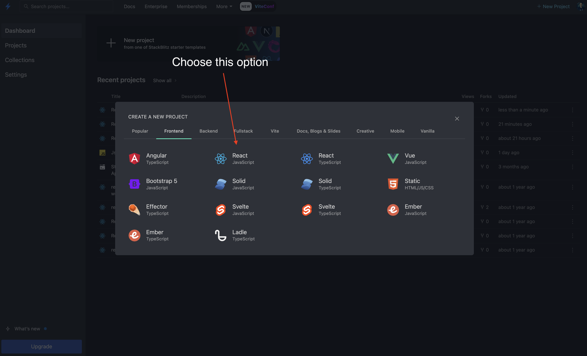
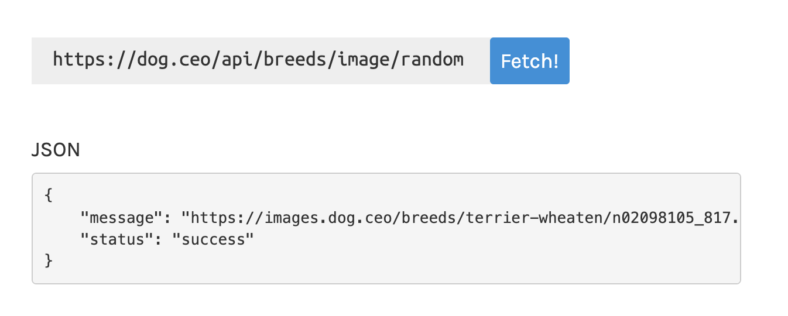

# React Dog API Application


## Objectives

Today we will build a React application that will request then render a random dog image from the Dog API. We will also implement a button to handle the image request.

Our learning objectives are:

- Implement `fetch` to request JSON data from a 3rd party API
- Explain how the `.json` method converts the API response into a JSON object
- Render an image inside a React component
- Implement the `useState` and `useEffect` hooks
- Add an event handler to request the data
- Understand JSX conditional rendering

<br>

## Getting Started

For this lesson we'll use an online IDE (Interavtice Development Environment) called Stack Blitz. Click on the link below and be sure to select the React - Javascript option like in the screenshot.

- [Stack Blitz Javascript React Starter](https://stackblitz.com/?starters=frontend)




- [Stack Blitz Solution](https://stackblitz.com/edit/stackblitz-starters-db21hz?description=A%20create-react-app%20project%20based%20on%20react%20and%20react-dom&file=README.md&file=md!README.md,src%2FApp.js,src%2Fstyle.css&title=React%20Starter)

<br>

## Fetch

#### Fetch
Javascript has a built in method called `fetch()` that starts the process of fetching a resource from a server. The `fetch()` method returns a Promise that resolves to a Response object.


<details>
  <summary>YOU DO: What is an API?</summary>

  > API is an abbreviation for Application Programming Interface. An API is a way for two or more computer programs to communicate with each other. 
  </details>


<br/>

We will use `fetch()` to retreive our image data from the Dog API. As with any API, it's a good idea to examine the documentation before we begin to write code.

- [Fetch Documentation](https://developer.mozilla.org/en-US/docs/Web/API/Fetch_API/Using_Fetch)
- [Dog API](https://dog.ceo/dog-api/)

Luckily, the documentation shows us exactlyy what to expect when we request a random dog image.

  

#### What property will we need to access based on the example response object?

<details>
  <summary>Answer</summary>

  `response.message`

</details>


<br>

## Retrieve a Dog object when the app first renders

1. First, let's use `fetch` to make a request to the Dog API.

    ```js
    // App.js
    const getDog = async () => {
      let data = await fetch('https://dog.ceo/api/breeds/image/random');
      let response = await data.json();
      console.log(response);
    };
    ```

1. We'll use a React hook called `useEffect` to invoke `getDog()` when the component initializes,

    - [useEffect](https://react.dev/reference/react/useEffect)

   > According to the React docs - `useEffect` is a React Hook that lets you synchronize a component with an external system.

    ```js
    // App.js 
    import React, { useEffect } from 'react';

    export default function App() {
      const getDog = async () => {
        let data = await fetch('https://dog.ceo/api/breeds/image/random');
        let response = await data.json();
        console.log(response);
      };

      useEffect(() => {
        getDog();
      }, []);

      return (
        <div>
          <h1>Dog API</h1>
        </div>
      );
    }
    ```


<br>

## Update the state of the app with `useState`

- [useState](https://react.dev/reference/react/useState)

  > useState is a React Hook that lets you add a state variable to your component.

  Call useState at the top level of your component to declare a state variable. The convention is to name state variables like [something, setSomething] using array destructuring.

  ```js
  const [state, setState] = useState(initialState);
  ```

    -  `initialState`: The value you want the `state` to be initially.
    - The `setState` function that lets you update the `state` to a different value and trigger a re-render.


1. First, make sure to import the `useState` hook in your `App` component.

    ```js
    // App.js
    import React, { useEffect, useState } from 'react';
    ```

1. Define a `dog` state variable and a `setDog` setted function. The initial state of the dog will be an empty object

    ```js
    // App.js

      ...

    export default function App() {

      const [dog, setDog] = useState({});
    ```

1. We'll use the setter method to update the value of `dog` when the response is received.

    ```js
      const getDog = async () => {
        let data = await fetch('https://dog.ceo/api/breeds/image/random');
        let response = await data.json();
        setDog(response);
        console.log(response);
      };    
    ```


<br>

## Render image in the `return` method

Let's add an image tag inside the JSX to render the `dog.message` property.

```html
    
```

<br />

<details>

  <summary>Why is the component rendering twice?</summary>

  #### React.Strict mode is on

  > StrictMode renders components twice (on dev but not production) in order to detect any problems with your code and warn you about them (which can be quite useful).


  To turn off this behavior, go into `index.js` and update the `root.render` method like so:

  ```js
  root.render(
    <>
      <App />
    </>
  ); 
  ```
</details>

<br>

## CSS

You may notice that the images aren't a consistent size. Here's some CSS you can add to your `src/style.css` to define a consistent height and width.

```css
img {
  width: 300px;
  height: 300px;
}
```


<br>


## Add a button and `onClick` event

  ```html
    <button onClick={getDog}>
      Get Dog
    </button>
  ```


<br>


## Conditional Rendering with a ternary

```html

```

or

```jsx
{dog.message ?  : ''}
```


<br>


## Add Material UI

[Material CSS](https://materializecss.com/)

`index.html`

```html
<link
  rel="stylesheet"
  href="https://cdnjs.cloudflare.com/ajax/libs/materialize/1.0.0/css/materialize.min.css"
/>

<div id="app"></div>
```

`App.js`

```js
      <button class="btn waves-effect waves-light" onClick={getDog}>
```


<br>

## Bonus

- Save a history of the dogs
- Add a dropdown menu to choose the breed of dog
- Add Material UI
- [Get multiple Dogs](https://dog.ceo/api/breeds/image/random/3)
- Refactor the image tag into a seperate Component
