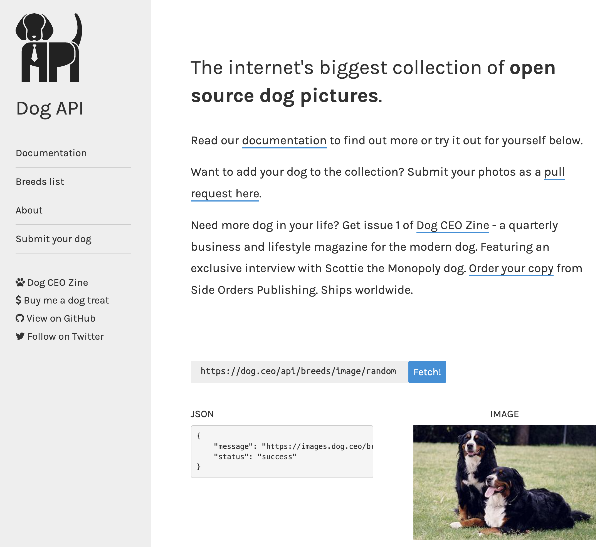

## Dog App



- [Dog API](https://dog.ceo/dog-api/)
- [Stack Blitz Solution](https://stackblitz.com/edit/stackblitz-starters-db21hz?description=A%20create-react-app%20project%20based%20on%20react%20and%20react-dom&file=README.md&file=md!README.md,src%2FApp.js,src%2Fstyle.css&title=React%20Starter)

## Objectives

- Use fetch to request JSON data from an external API
- Use `.json` to convert response data into a JSON object
- Render data into a component
- Use `useState` to store the data
- Add an event handler to request the data

## Fetch

[Fetch Documentation](https://developer.mozilla.org/en-US/docs/Web/API/Fetch_API/Using_Fetch)

```js
  const getDog = async () => {
    let data = await fetch('https://dog.ceo/api/breeds/image/random');
    let response = await data.json();
    console.log(response);
  };
```

## useState

## Save response to useState

## render image in the return

## Add a button and `onClick` event

## CSS

```css
img {
  width: 300px;
  height: 300px;
}
```

## Conditional Rendering with a ternary

```js

```

or

```jsx
{dog.message ?  : ''}
```

## Bonus

- Save a history of the dogs
- Add a dropdown menu to choose the breed of dog
- Add Material UI
- [Get multiple Dogs](https://dog.ceo/api/breeds/image/random/3)
- Refactor the image tag into a seperate Component

```

```
